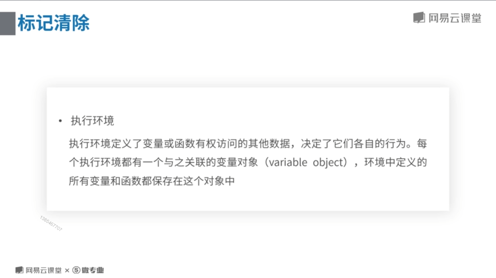
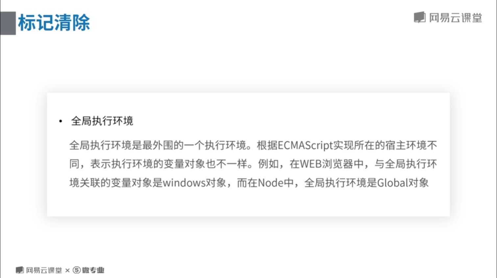
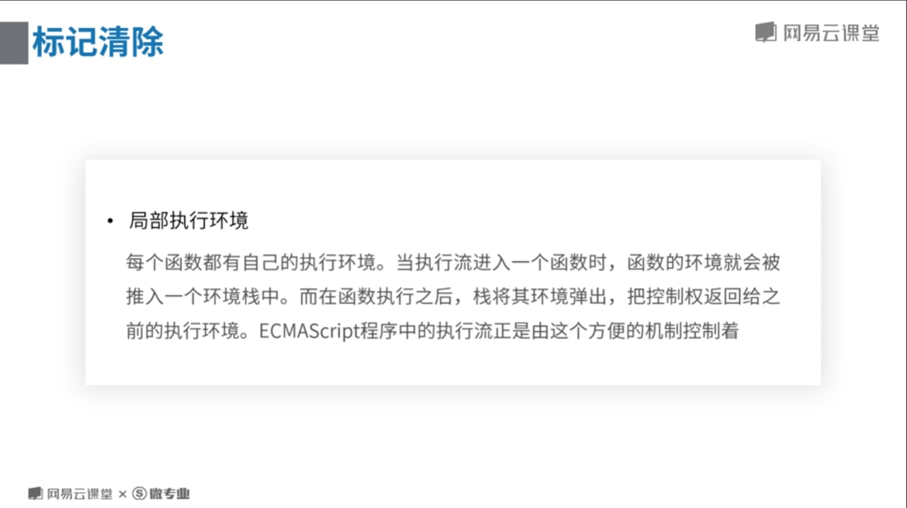
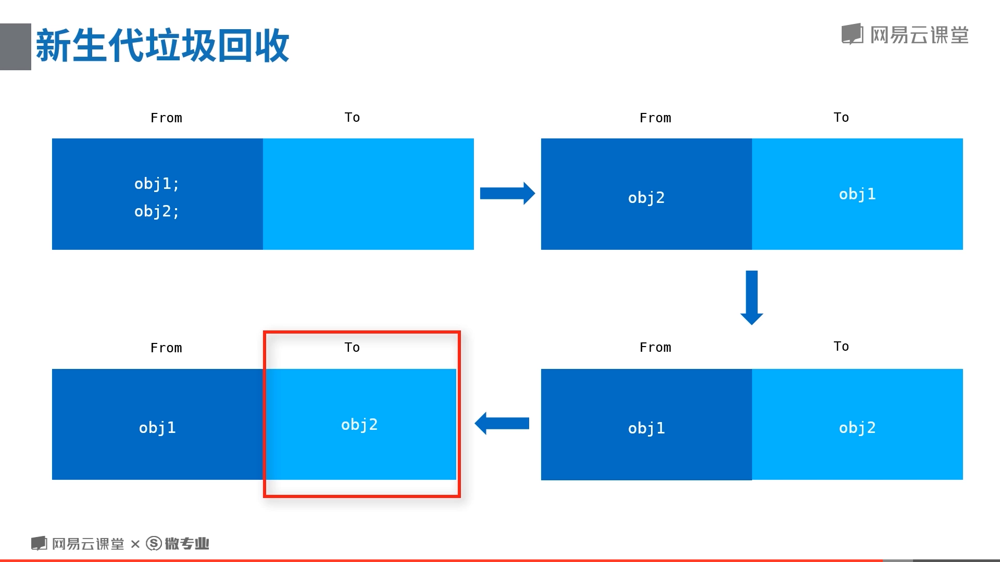
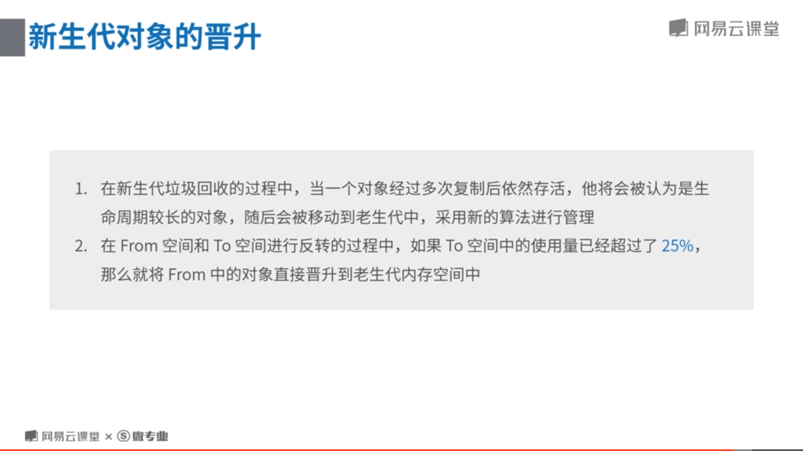
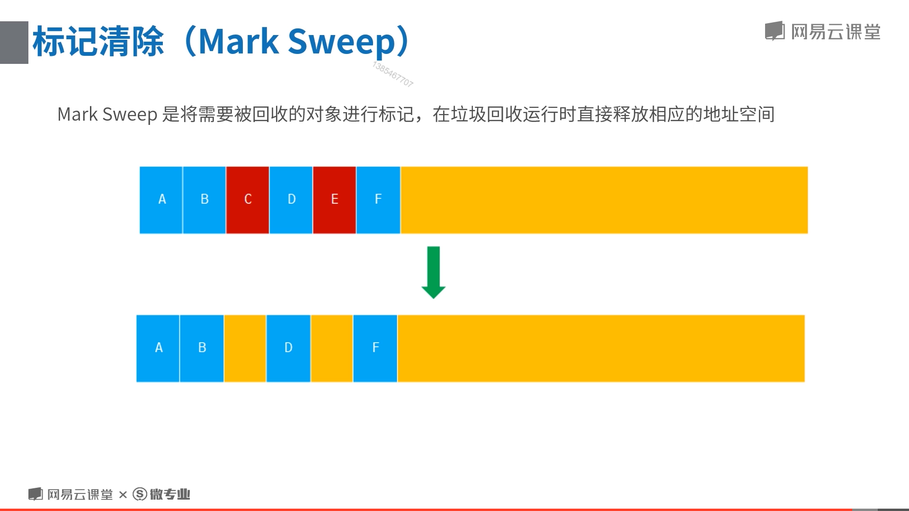
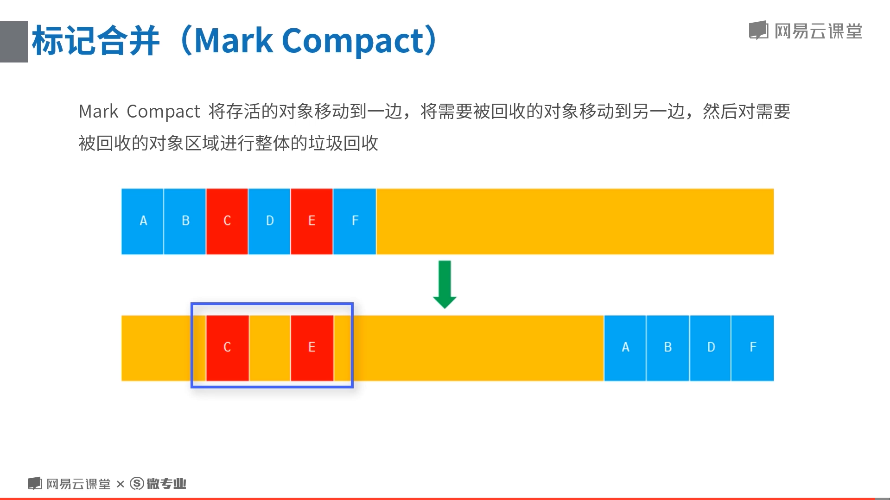

# 引用计数
  追踪记录每个值被引用的次数，如果一个值的引用次数是0，则说明这个值不再用到了。则可以释放这个值的内存空间。

  一个值被引用一次，计数就加1，释放就减1，变为0时，就可以释放这个块内存。

  *IE8及之前的浏览器使用的规则

# 标记清除
  现代浏览器使用普遍使用这个机制。

  当变量进入环境时，标记为这个变量为“进入环境”，当变量离开环境时，标记这个变量为“离开环境”。

  最后，垃圾回收器销毁掉被标记为“离开环境”的变量所占用的内存空间。

  ## 执行环境

  

  ## 全局环境

  

  ## 局部环境

  

# V8引擎回收策略
  
  V8将内存分为两个生代，采用不同的算法进行垃圾回收。

## 新生代

  

  回收新生代对象，主要通过Scavenge算法进行垃圾回收,在Scavenge的具体 实现中,主要采用了Cheney算法。
  
  Cheney 算法是一种采用复制的方式实现的垃圾回收算法。它将堆内存一分为二,每一部分空间称为 semispace。在这两个 semispace 空间中,只有一个处于使用中,另一个处于闲置状态。处于使用状态的空间称为 From 空间,处于闲置状态的空间称为 To 空间。当我们分配对象时,先是在 From 空间中进行分配。当开始进行垃圾回收时,会检查 From 空间中的存活对象,这些存活对象将被复制到 To 空间中, 然后反转From、To空间，释放To空间的内存。

## 老生代
  
  

  ### 标记清除

  

  标记清除会造成内存空间不连续的问题。

  ### 标记合并

  

# 增量标记

  为了避免出现 JavaScript 应用逻辑与垃圾回收器看到的不一致的情况,垃圾回收的 3 种基本算法都需要将应用逻辑暂停下来,待执行完垃圾回收后再恢复执行应用逻辑,这种行为被称为“全停顿"，长时间的"全停顿"垃圾回收会让用户感受到明显的卡顿，带来体验的影响。以1.5 GB的垃圾回收堆内存为例,V8做一次小的垃圾回收需要50毫秒以上,做一次非增量式的垃圾回收甚至要1秒以上。这是垃圾回收中引起JavaScript线程暂停执行的时间,在 这样的时间花销下,应用的性能和响应能力都会直线下降。
  
为了降低全堆垃圾回收带来的停顿时间,V8先从标记阶段入手,将原本要一口气停顿完成的动作改为增量标记(incremental marking),也就是拆分为许多小“步进”,每做完一“步进” 就让 JavaScript 应用逻辑执行一小会儿,垃圾回收与应用逻辑交替执行直到标记阶段完成
