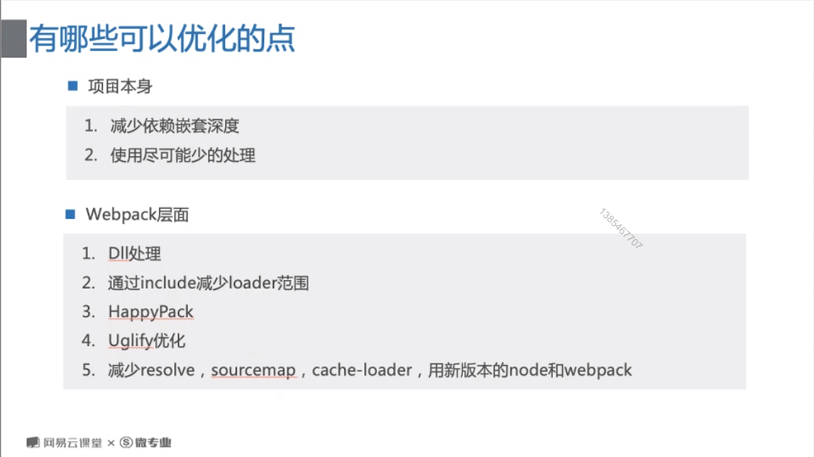

# 分析打包结果

## 官方推荐

指令：webpack --profile --json > stats.json

导出 stats.json

在<a href="https://webpack.github.io/analyse/#home">https://webpack.github.io/analyse/#home</a>上传 stats.json

## 社区版本

webpack-bundle-analyzer

安装 webpack-bundle-analyzer 插件，引入：

```javascript
const bundleAnalyzer = require("webpack-bundle-analyzer").BundleAnalyzerPlugin;
...

new bundleAnalyzer()
```

# 优化打包



## dll 处理

预打包不会经常改动的第三方库或者框架的代码。

webpack.config.js

```javascript
    //plugins里的配置，多个库new多个
    new webpack.DllReferencePlugin({
      manifest: require("./src/dll/jquery.json"),
    }),
```

webpack.dll.js

```javascript
const { DllPlugin } = require("webpack");

module.exports = {
  mode: "production",
  //多个库写多个键值对
  entry: {
    jquery: ["jquery"],
  },
  output: {
    filename: "./[name].js",
    path: __dirname + "/src/dll",
    //引用名
    library: "[name]",
  },
  plugins: [
    new DllPlugin({
      path: __dirname + "/src/dll/[name].json",
      name: "[name]",
    }),
  ],
};
```

## 多线程编译 loader

webpack.config.js

```javascript
const happyPack = require("happypack");
const os = require("os");
const happyThreadPool = happyPack.ThreadPool({ size: os.cpus().length });

...

//loader替换
{
  test: /\.jsx?$/,
  use: {
    loader: "happyPack/loader?id=happyBabel",
  },
},

...

//plugins里插件添加
new happyPack({
  id: "happyBabel",
  loaders: [
    {
      loader: "babel-loader?cacheDirectory=true",
    },
  ],
  threadPool: happyThreadPool,
  // 显示日志
  verbose: true,
})

```

## 长缓存优化

webpack.config.js

```javascript
  output: {
    //hash换为chunkhash
    filename: "[name].[chunkhash:8].bundle.js", //name是entry的键明——index
    path: __dirname + "/dist",
  },

```

引入包的顺序变了也不会改变打包后的文件名字。

webpack4 升级为 webpack5 的变更。

NamedModulesPlugin → optimization.moduleIds: 'named'
NamedChunksPlugin → optimization.chunkIds: 'named'
