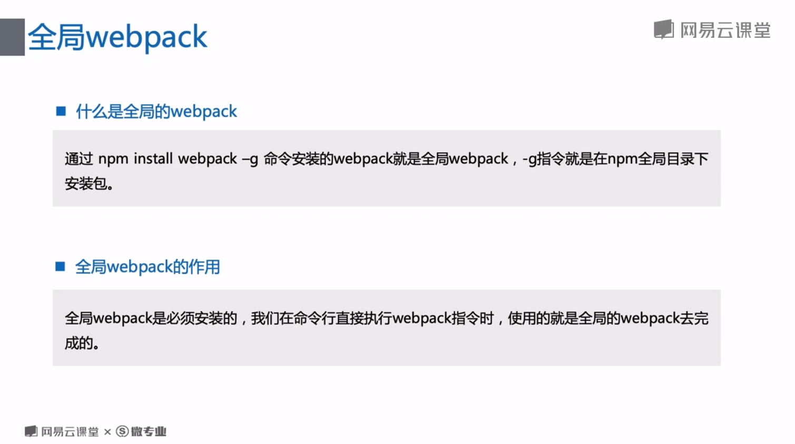
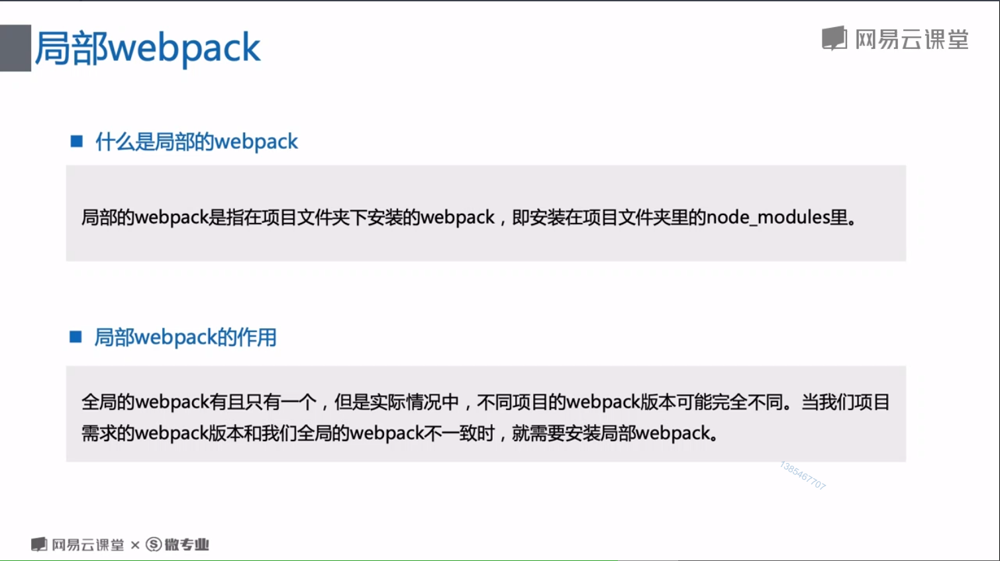
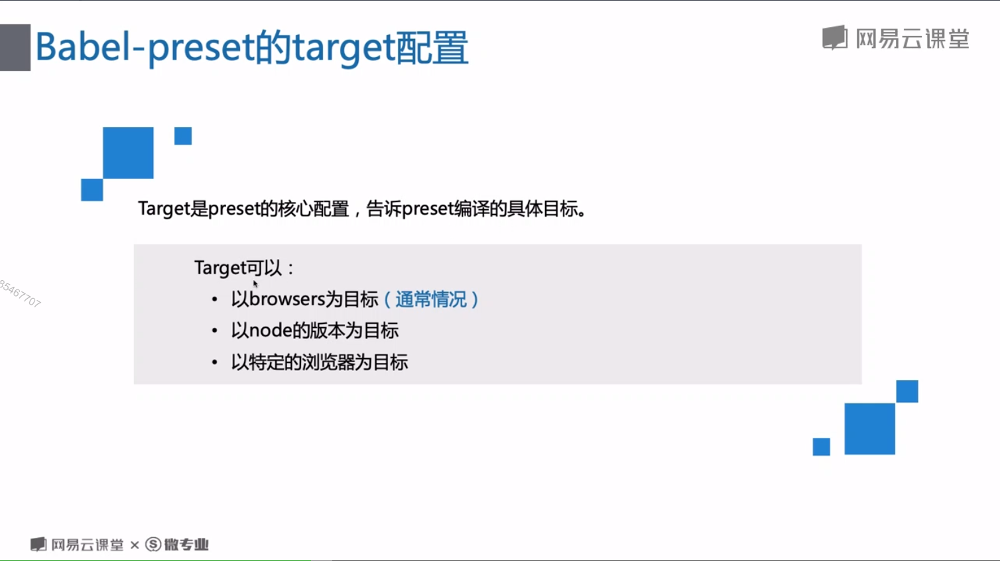
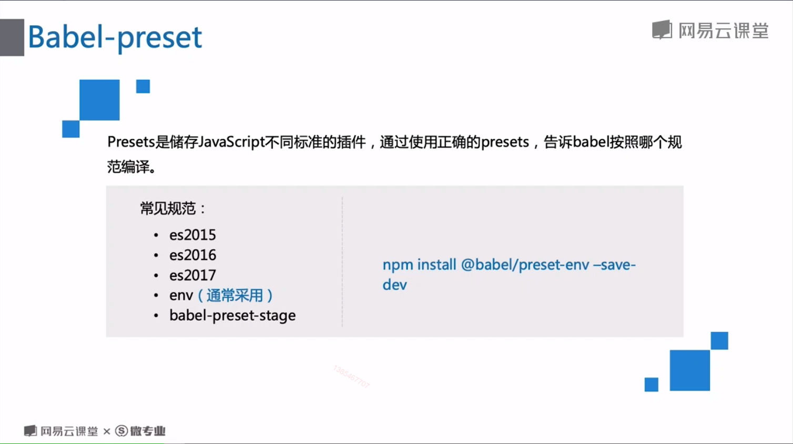
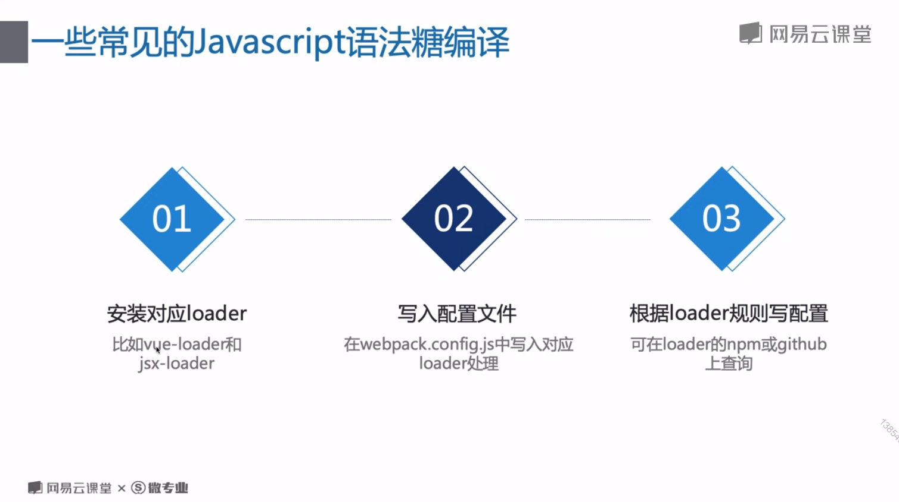

# 全局 Webpack 与局部 Webpack

## 全局 Webpack

<br/>



全局 Webpack 打包，直接命令行里 webpack 指令。

## 局部 Webpack

<br/>



局部 Webpack 打包，package.json 里添加 scripts 里添加 build 值为 webpack，会优先局部 webpack 打包。或者命令行里 npx webpack 指令.

# js-loader

## babel-preset

编译 js 至低版本，一般是 es5，兼容低版本浏览器。
<br/>


<br/>



## polyfill, transform-runtime

babel-polyfill, 全局垫片对象，重些所有 es6 的 api。会污染全局环境，适合写项目。
babel-transform-runtime, 局部垫片对象，只会把用的 api 打进包里，适合写框架。

## 其他 js 语法糖或者超集（vue-loader,ts-loader）

<br/>



# 代码部分

## webpack.config.js

```javascript
module.exports = {
  entry: {
    index: "./app.js",
    // index: ["babel-polyfill", "/app.js"], //polyfill编译js
  },
  output: {
    filename: "[name].[hash:8].js", //name是entry的键明——index
  },
  module: {
    rules: [
      {
        test: /\.jsx?$/,
        use: {
          loader: "babel-loader",
        },
      },
      {
        test: /\.tsx?$/,
        use: {
          loader: "ts-loader",
        },
      },
    ],
  },
};
```

## .babelrc

```javascript
{
  "presets": [
    [
      "@babel/preset-env",
      {
        targets: {
          browsers: ">1%",
        },
      },
    ],
  ],
  "plugins":[
    ["@babel/transform-runtime"]//babel-transform-runtime 编译js
  ]
},
```

## tsconfig.json

```javascript
{
  "compilerOptions": {
    "module": "commonjs",
    "target": "es5"
  },
  "exclude": ["./node_modules"]
}
```
