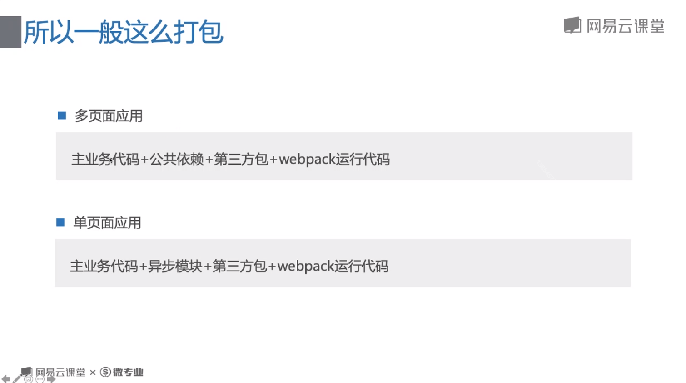
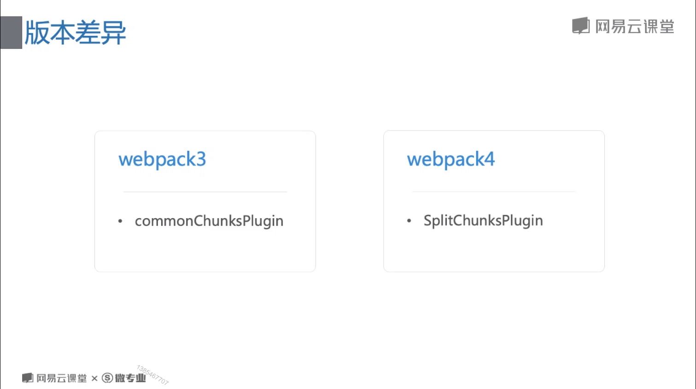
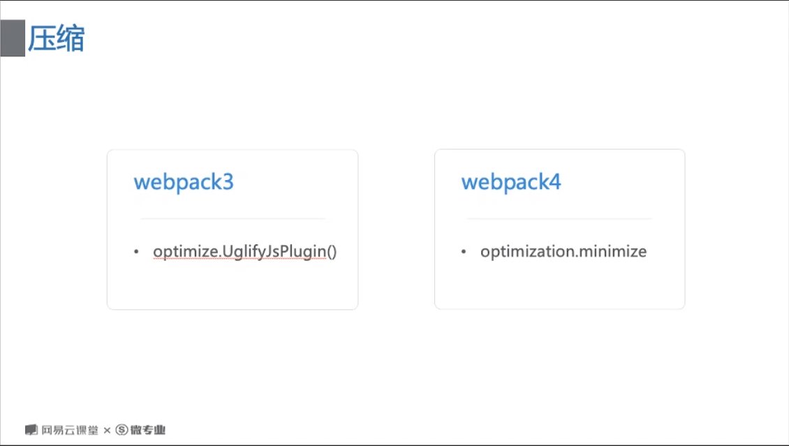
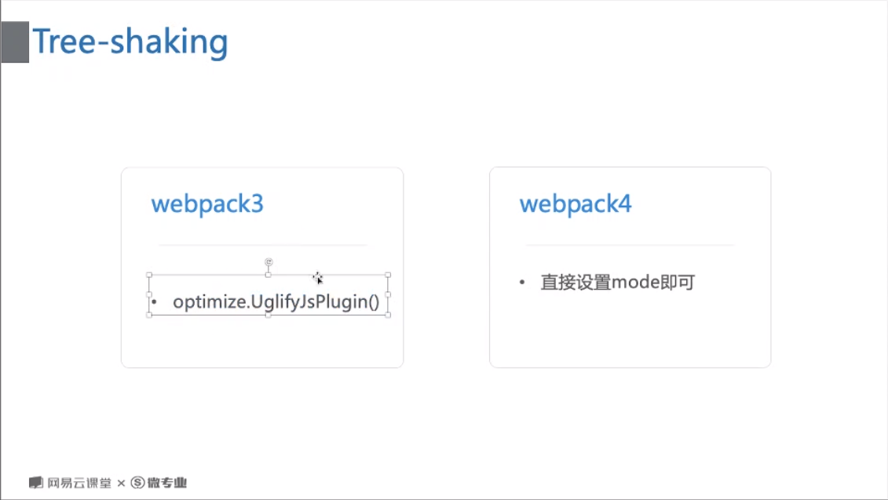

# 多页面应用，单页面应用的不同。



# 版本差异

## 代码分割



## 压缩



## tree-shaking



webpack.config.js

```javascript
const MiniCssExtractPlugin = require("mini-css-extract-plugin");
const HtmlWebpackPlugin = require("html-webpack-plugin");
const webpack = require("webpack");
const { CleanWebpackPlugin } = require("clean-webpack-plugin");
const path = require("path");

module.exports = {
  mode: "development",
  target: "web",
  entry: {
    app: "./app.js",
    // app2: "./app2.js",
    // index: ["babel-polyfill", "/app.js"],
  },
  output: {
    filename: "[name].[hash:8].bundle.js", //name是entry的键明——index
    // publicPath: "../", //css,js（head标签内）等引入的资源的统一的路径
    path: path.resolve(process.cwd(), "dist"),
  },
  optimization: {
    // minimize: true, // 打包代码压缩，或者 mode: "production",
    splitChunks: {
      chunks: "all",
      minSize: 0, //公用模块的抽离，请求次数与文件大小的平衡，设置为0的无论多小都会单独分出一个模块
      //强制抽离某个模块
      // cacheGroups: {
      //   module1: {
      //     test: /mode1/,
      //   },
      // },
    },
    runtimeChunk: true,
  },
  module: {
    rules: [
      {
        test: /\.scss$/,
        use: [
          {
            loader: MiniCssExtractPlugin.loader,
            options: {
              publicPath: "../", //把css里的图片等资源url加上../
            },
          },
          {
            loader: "css-loader",
            options: {
              // url: false,
            },
          },
          "postcss-loader",
          "sass-loader",
        ],
      },
      {
        test: /\.(png|jpg|gif)$/i,
        use: [
          {
            loader: "url-loader",
            options: {
              name: "[name].[hash:8].[ext]",
              outputPath: "assets/img", //打包后的图片放在哪
              // publicPath: "assets/img", //图片文件名前的统一路径，加了之后无论是css还是HTML里都会加
              limit: 5000, //设置图片转base64的阈值
            },
          },
          {
            loader: "img-loader",
            options: {
              plugins: [
                require("imagemin-gifsicle")({
                  optimizationLevel: 1, //1-3越大压缩越厉害
                }),
                require("imagemin-mozjpeg")({
                  quality: 80, //1-100越小压缩越厉害
                }),
                require("imagemin-pngquant")({
                  speed: 2, //1-11越小压缩越厉害
                }),
              ],
            },
          },
        ],
      },
      {
        test: /\.html$/i,
        use: {
          loader: "html-loader",
          options: {
            // attrs: ["img:data-src"], //定义哪个标签的哪个属性解析url
          },
        },
      },
    ],
  },
  plugins: [
    new MiniCssExtractPlugin({
      filename: "./css/[name].min.css",
    }),
    new HtmlWebpackPlugin({
      filename: "index.html",
      template: "./index.html",
      favicon: "./assets/img/aaa.jpg",
      meta: {
        viewport: "width=device-width, initial-scale=1, shrink-to-fit=no",
      },
      hash: true,
    }),
    new webpack.HotModuleReplacementPlugin(),
    new CleanWebpackPlugin(),
  ],
  devtool: "eval-cheap-module-source-map",
  devServer: {
    hot: true,
    hotOnly: true, //只要热更新，不要living loading（自动刷新浏览器）；
    overlay: { errors: true },
    // inline: false,
    // historyApiFallback: true,
    historyApiFallback: {
      rewrites: [
        {
          from: /^\/([ -~]+)/,
          to: function(context) {
            return "./" + context.match[1] + ".html";
          },
        },
      ],
    },
    proxy: {
      "/j": {
        target: "https://study.163.com/",
        changeOrigin: true,
        pathRewrite: {
          "^/j/1": "/j/navi/getShopCartCount.json",
        },
      },
    },
  },
};
```

tree-shaking 跟 babel 有冲突。需要设置一下 babel 不要编译 module 相关的部分。

.babelrc

```javascript
{
  "presets": [
    [
      "@babel/preset-env",
      {
        targets: {
          browsers: ">1%",
        },
        modules:false//不对module编译
      },
    ],
  ],
  "plugins":[
    ["@babel/transform-runtime"]
  ]
}
```
