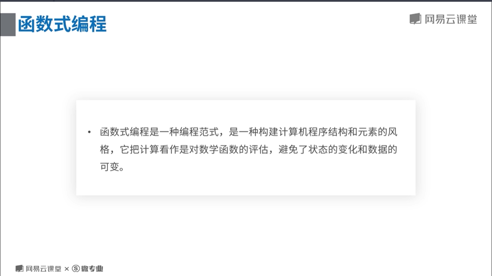
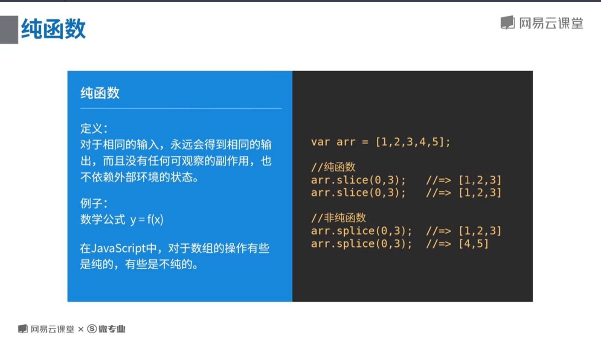
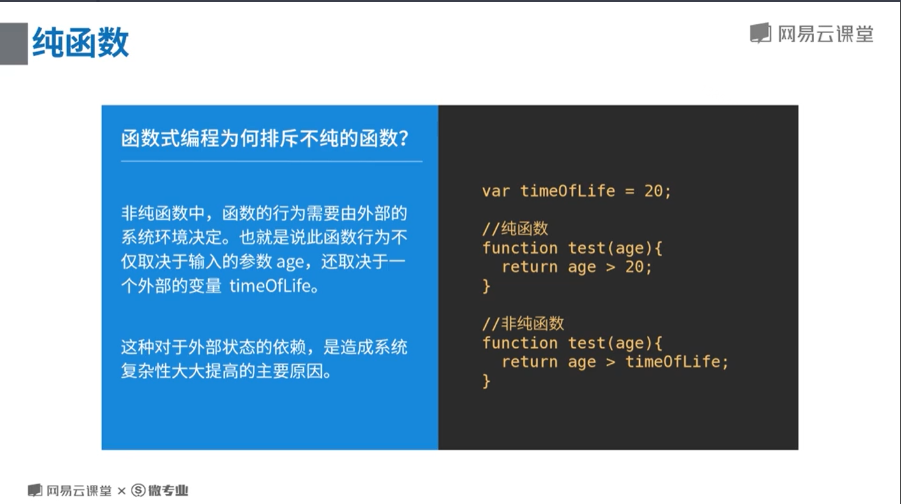
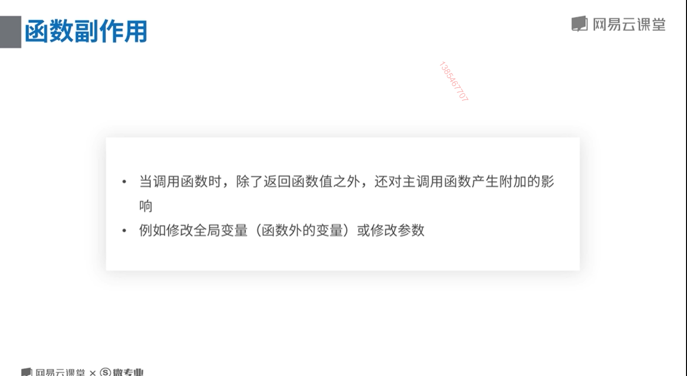
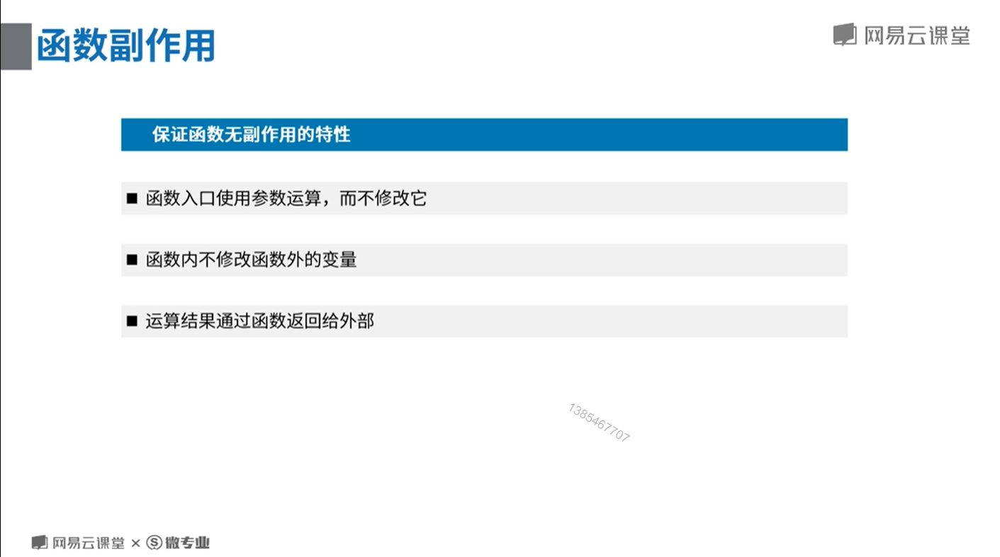
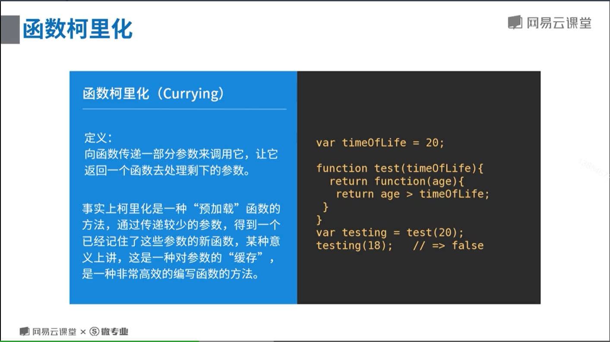
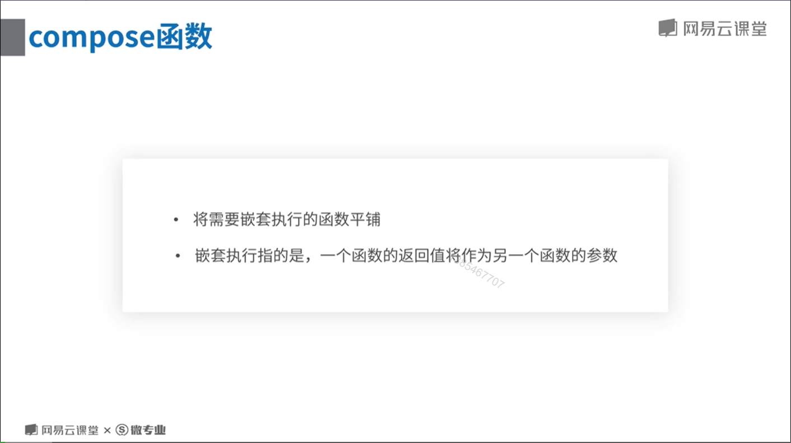
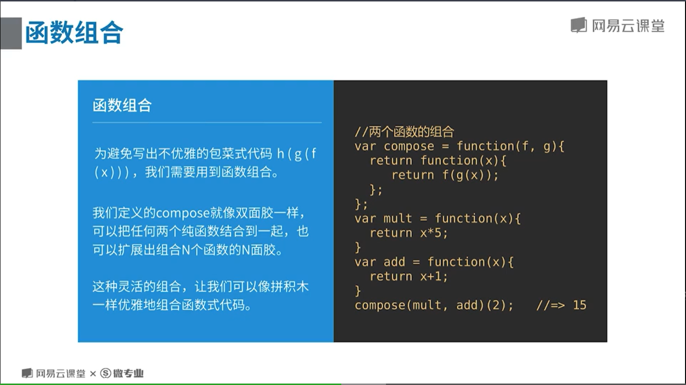
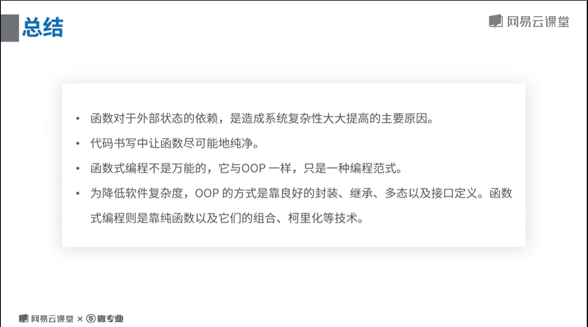

# 函数式编程的一些特性

## 什么是函数式编程？

<br/>


## 函数式编程的特性

### 纯函数

<br/>


<br/>


<br/>


### 无函数副作用

<br/>


<br/>


### 函数柯里化

<br/>


### 函数组合——compose、pipe 函数

<br/>


<br/>


```JavaScript
    const add = a => a + 10
    const multi = a => a * 10

    const compose = function () {
      const arg = [].slice.call(arguments)
      return function (params) {
        return arg.reduceRight((acc, cur) => cur(acc)
          , params)
      }
    }
    const pipe = function () {
      const arg = [].slice.call(arguments)
      return function (params) {
        return arg.reduce((acc, cur) => cur(acc)
          , params)
      }
    }

    const composeRes = compose(multi, add)
    const pipeRes = pipe(multi, add)

    console.log(composeRes(2)); //120 compose自右向左
    console.log(pipeRes(2)); //30 pipe自左向右
```

## 总结

<br/>

