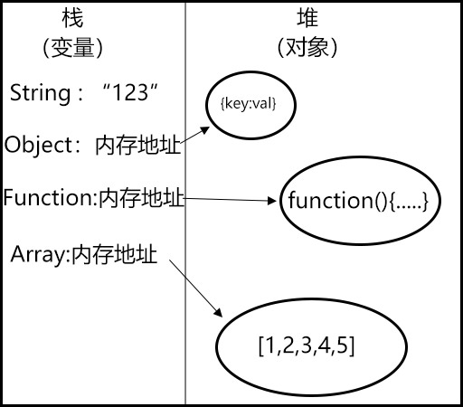
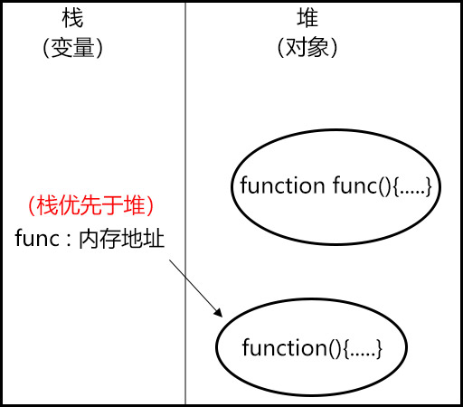
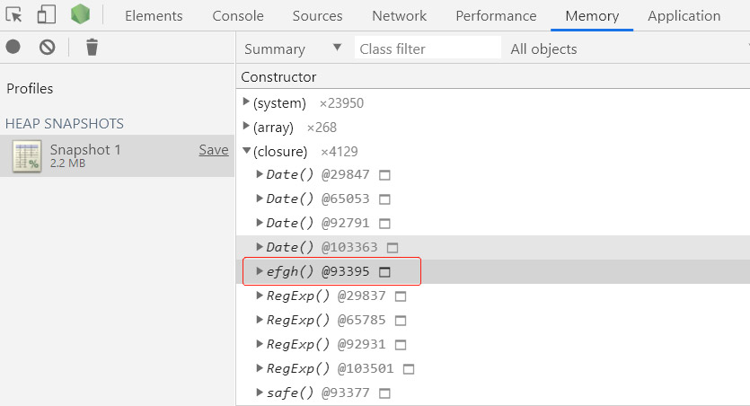

# JavaScript 内存管理机制与其一些运行规则

## JavaScript 的内存管理

### 栈、堆

&emsp;&emsp;JavaScript 作为一门弱语言，不像 C、Java 这样的强语言可以用控制内存的管理，而是由 JS 引擎自己来管理内存，在内存中有栈跟堆两块区域。栈中存放着变量，而在 JS 中数据分为基本型和引用型。基本型包括 Number,String,Boolean,Undefined,Null。当变量为基本型数据时，栈中存放的就是这个数据本身的值，比如 var a = "123",那么栈中存放的就是这个 123。而数据为引用型时，指的就是 Object 对象，这时栈中存放就是这个 Object 所在的内存的地址。而这个内存地址是从何而来？答案就是在堆中，堆中只存放着 Object 对象，如下图所示：（因为 function 和 array 都继承于 Object，所以也都是对象。）



&emsp;&emsp;由于这种内存管理机制，就会造成一种看似很不合理的现象，比如你无法通过"array===[]"来判断一个数组是否为空，因为内存中存放的是两个不同的内存地址，而非空数组这个值。所以这个等式自然不成立的。又或你也不能通过"objectA = objectB"来复制一个对象，同样是因为内存中存放的是内存地址，实际上这两个对象指向的是堆中的同一个对象，这就导致修改了 A 的内容，B 的内容也会跟着修改。

## 一些 js 的运行规则

### “先定义，后执行”

&emsp;&emsp;js 代码中运行遵循“先定义，后执行”的规则，所谓“先定义，后执行”是指，js 会优先运行定义代码，再运行执行代码。

```javascript
console.log(a);
var a = "123";
```

&emsp;&emsp;上面这段代码的打印结果为"undefined"，而按照我们的理解结果应为"a is not defined"。这就是因为“先定义，后执行”规则。定义代码 var a,被提升到了执行代码 console.log(a)之前。但是它的赋值却没有被提升。这种现象被称为“变量提升，或者声明提升”。上面的代码等同于下面这段：

```javascript
var a;
console.log(a);
a = "123";
```

### 先在栈中查找，后在堆中查找

&emsp;&emsp;关于 function 的定义有两种方式，一种是声明一个变量把一个匿名的函数赋值给它，另一种是通过 function 关键字来声明一个函数。而这两种方式在内存中的表现形式是不同的。第一种是按照上面介绍的方式，在堆中存放这个 function,在栈中存放堆中的内存地址。而通过 function 定义，是在堆中存放这个内存的地址。这时又有一种规则：

```javascript
function func() {
  console.log(2);
}
var func = function() {
  console.log(1);
};
func();
```

```javascript
var func = [];
function func() {
  console.log(2);
}
func();
```

```javascript
var func;
function func() {
  console.log(2);
}
func();
```

&emsp;&emsp;这三段代码的结果分别为 1、"func is not a function"、和 2，这是因为——当栈中和堆中定义了同一个变量时，只要栈中的变量有值，js 都会有优先栈中的变量为准，除非栈中的变量没有赋值，才会以堆中的变量为准。而造成这种现象的原因是因为在内存中堆要比栈大非常多，查找同样一个变量，在堆中查找要比在栈中查找费时的多。js 基于这原因才会有这种设计规则。如图：



### 闭包现象

&emsp;&emsp;在内存中还有一块区域，叫做运行时。他的作用是当代码运行到 function（）{}函数块时，在运行时中就会去调用堆中的 function 并在其内部开辟一块临时的内存空间。这块内存空间中也有栈、堆，用于存放这个 function 作用域中的变量。当 function 运行结束，function 就会从运行时中退出。并销毁这块临时的内存空间。但是当这个内存空间销毁不了时，这块作用域就会一直存在于内存之中。这就造成了闭包现象。

```js
var abcd = 1;
function efgh() {
  console.log(abcd);
}
efgh();
```

&emsp;&emsp;上面这段代码，当运行 efgh()时，需要打印变量 abcd，但是 efgh 函数作用域中并不存在这个变量，这时根据作用域链，js 会往上一级作用域中查找，这时找到了全局作用域中的变量 abcd，但是当 efgh 要结束时，因为全局作用域只有浏览器关闭才会销毁，这时就造成了 abcd 销毁不了，从而 efgh 中的这块临时内存空间也就销毁不了，形成了闭包。通过浏览器的调试工具可以得到印证：


