# Vue内部运行机制及生命周期

## Vue内部运行机制

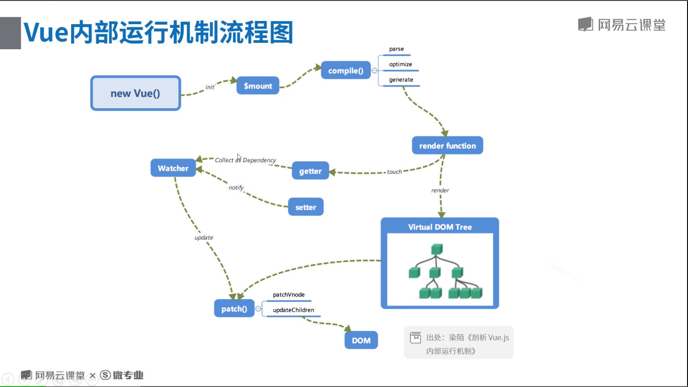

### 初始化与挂载

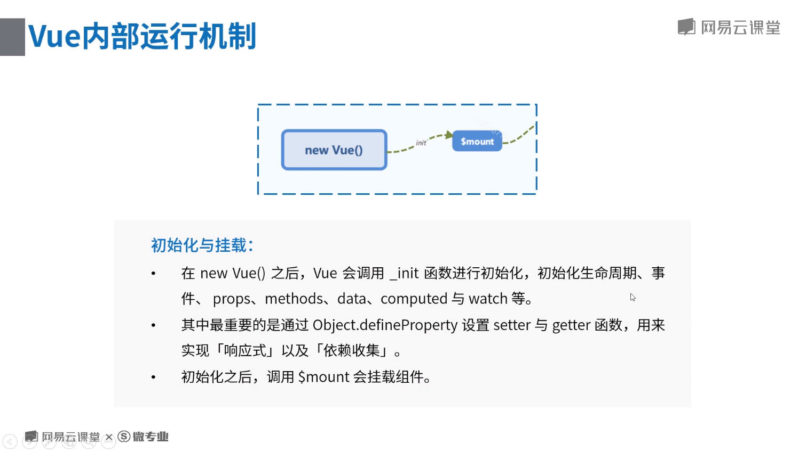

### 模板编译

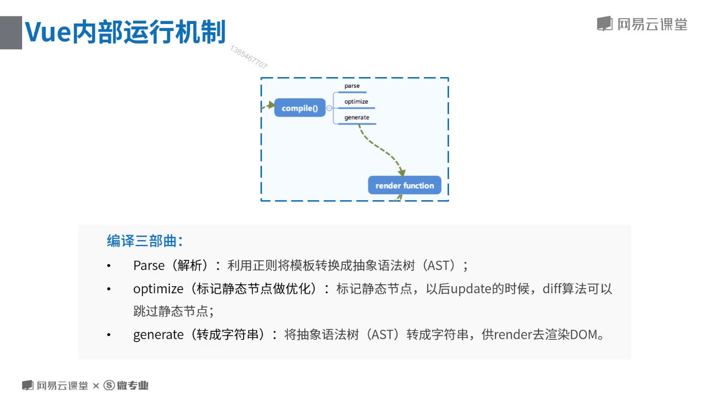

<font color="color:#ff0000">* **抽象语法树是JSON格式的对象**</font>

### 数据响应

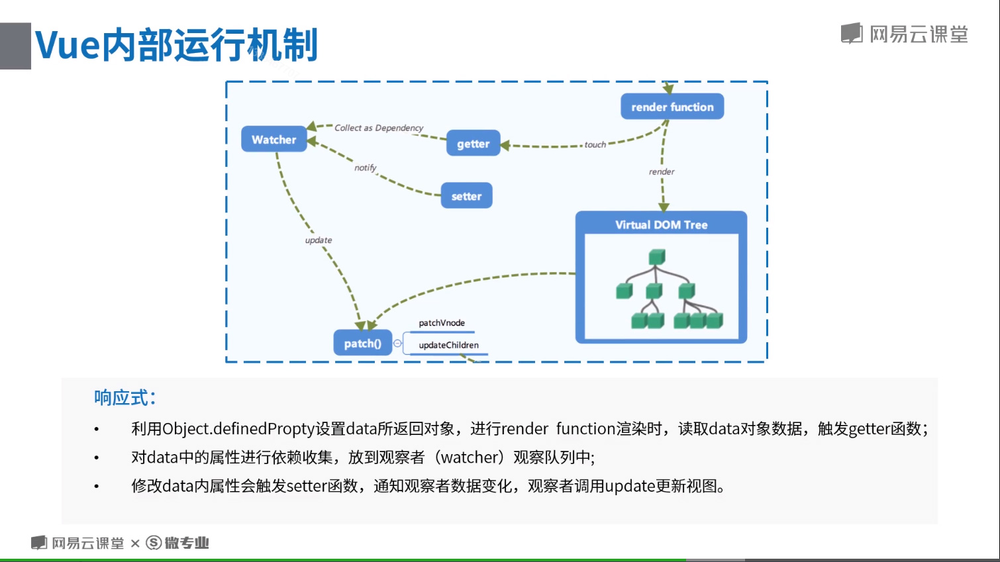

### 更新视图

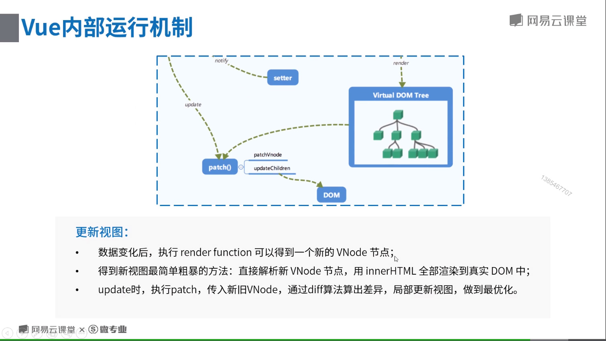

## Vue生命周期

### 完整的生命周期流程


### 各生命周期el与data的不同

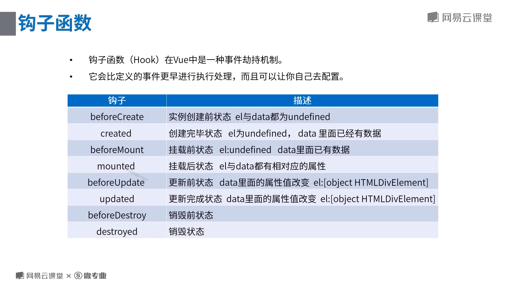

### 各生命周期详解

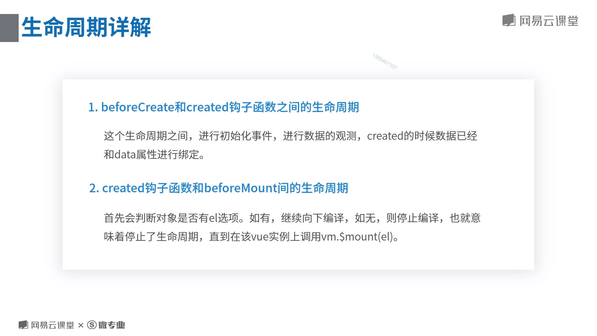

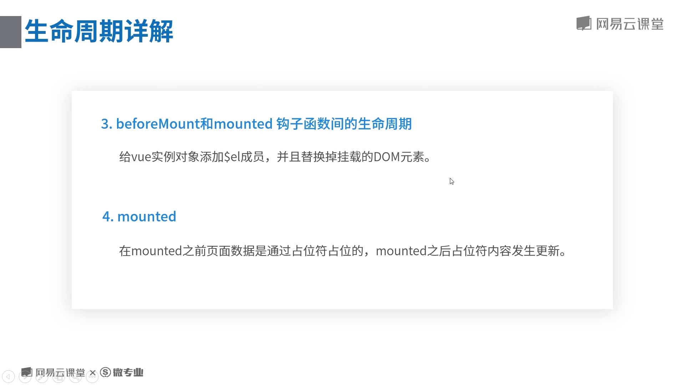

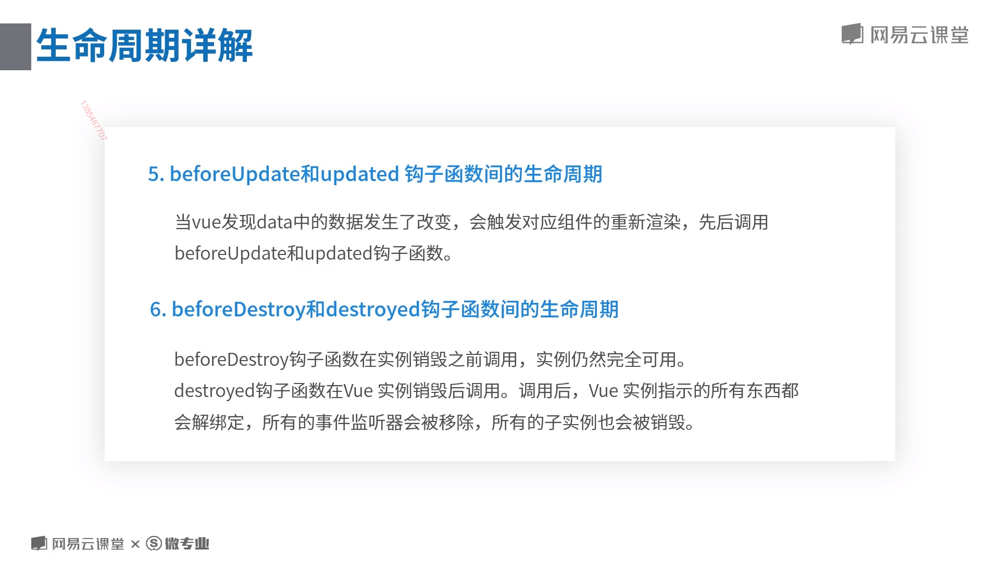

### 代码示例

```javascript
<script type="text/javascript">
    window.onload = function() {
        var vm = new Vue({
            el: '#app',
            data: {
                myText: '我是生命周期！',
            },
            beforeCreate () {
                console.log('==============' + 'beforeCreated' + '===================')
                console.log(this.$el)
                console.log(this.$data)
            },
            created () {
                console.log('==============' + 'created' + '===================')
                console.log(this.$el)
                console.log(this.$data)
            },
            beforeMount () {
                console.log('==============' + 'beforeMount' + '===================')
                console.log(this.$el)
                console.log(this.$data)
            },
            mounted () {
                console.log('==============' + 'mounted' + '===================')
                console.log(this.$el)
                console.log(this.$data)
            },
            beforeUpdate () {
                debugger
                console.log('==============' + 'beforeUpdate' + '===================')
                console.log(this.$el)
                console.log(this.$data)
                console.log(this.$el.innerHTML)
                console.log(document.getElementById('myText').innerText)
                debugger
            },
            updated () {
                console.log('==============' + 'updated' + '===================')
                console.log(this.$el)
                console.log(this.$data)
                console.log(this.$el.innerHTML)
                console.log(document.getElementById('myText').innerText)
            },
            beforeDestroy () {
                console.log('==============' + 'beforeDestroy' + '===================')
                console.log(this.$el)
                console.log(this.$data)
            },
            destroyed () {
                console.log('==============' + 'destroyed' + '===================')
                console.log(this.$el)
                console.log(this.$data)     
            }
        })
        
    }
</script> 

<div id="app">
    <input type="text" v-model="myText">
    <div id="myText">{{myText}}</div>
</div>

```

运行结果：

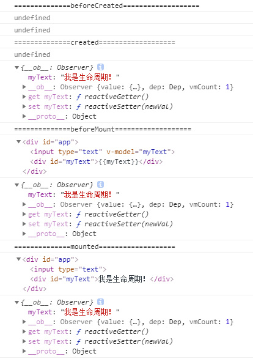

<font color="color:#ff0000">* **注意beforeMount和mounted的$el中占位符的替换。**</font>

修改data中的数据：

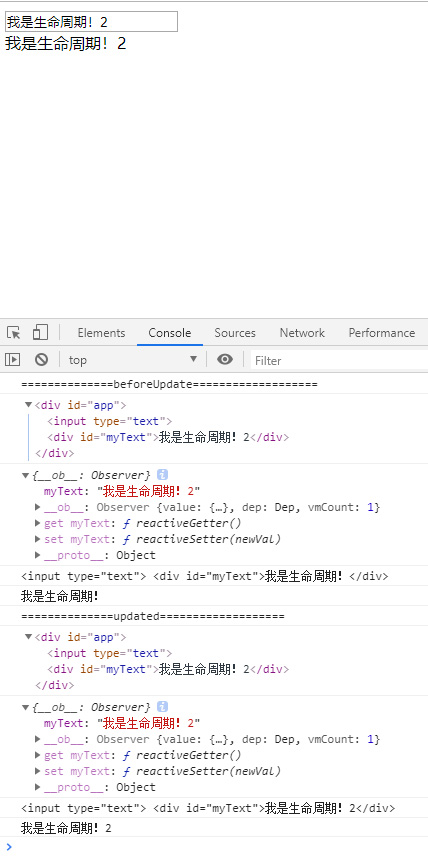

<font color="color:#ff0000">* **注意$el和$data的打印，update前后是一样的，而真实DOM中的却不一样。查阅原因似乎是$el是虚拟DOM，本质是一个对象，栈中存放的是内存地址的指针。而console.log的特性是在点击输出结果前面的箭头之前，其实里面是没有内容的，当点击时才会根据这个指针去寻找结果然后显示，所以当点击时已经是updated生命周期了。所以使用真实DOM才会显示的正确的结果。**</font>

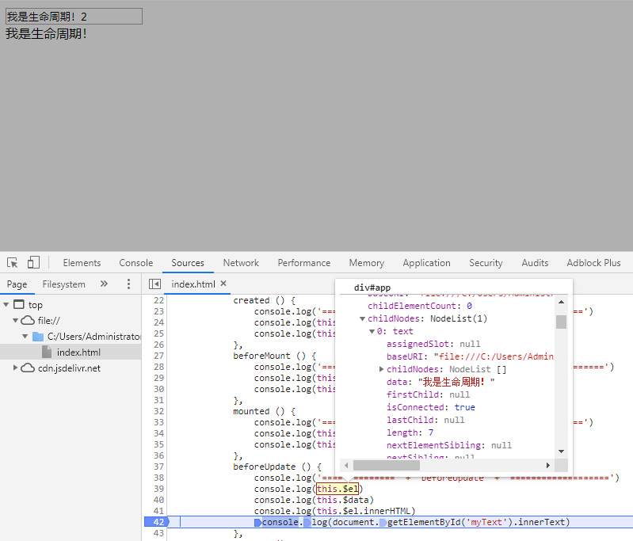

通过debugger断点查看得到了正确的结果。
